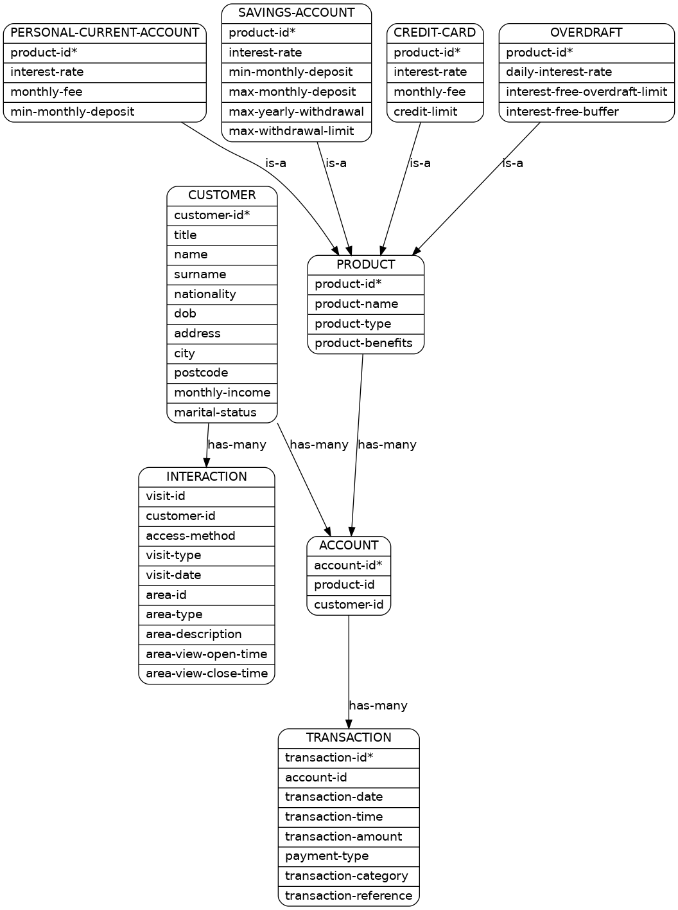

# Tables

- In the graph below, each element represents a table (like PRODUCT or ACCOUNT).  
- Each table is a set of points (the points are not shown in the graph).  
- Each point contains several fields (whose names are listed under the table's name).  
- Each field of a point contains some value (not shown in the graph).  
- A field is "unique" (with respect to a certain table) if it is listed with an asterisk "\*".  
- No two values of a unique field can be the same.  

# Constraints

Arrows in the graph represent constraints between tables. If there is no arrow between two tables, then they don't share any fields with the same name.

## T1 is-a T2

Each point in T1 must map to a unique point in T2 (identified by T1's unique field).

For example:

- a credit card is a product. 
- an overdraft is a product.

## T1 has-many T2

Each point in T1 must map to a set of points in T2 (identified by T1's unique field). T2 is the union of the range of that map.

For example: 

- A customer can have several accounts.
- There can be several accounts of the same product.
- An account can have several transactions.

# Graph

